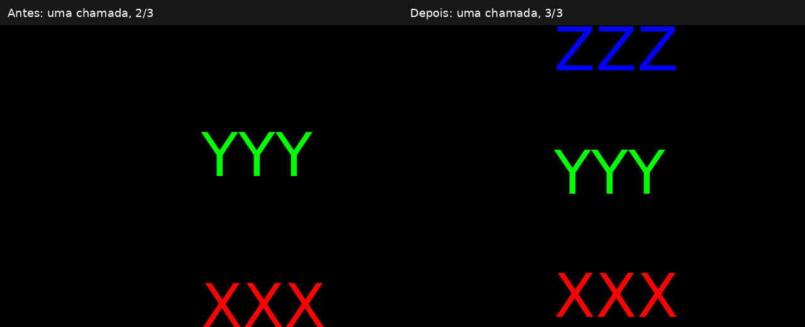

# SoText2: one-call viewAll contract still open

PR #774 remains draft. The initial repair failed the single-call multi-label
regression below. The local implementation now includes bounded final-camera
fitting and the regression is registered in CTest. Historical results are kept
below to explain the design choice.

## Reproduction and oracle

`SoText2ViewAllAudit.cpp` reproduces BUGS.txt item 219: `XXX` at y=0, `YYY` at
y=100 and `ZZZ` at y=200, with cumulative translations. Red/green/blue distinguish
the labels without changing geometry. The oracle first renders all labels with
a manually placed camera that contains them, then counts each color's coverage.
Each post-fit label must have the same pixel count as that fully visible
reference; merely drawing one pixel is not success. Both counts are reported.

The initial 12 cases use perspective/orthographic cameras, builtin font sizes 10/24/96
and slack 1/1.1, in a 640x480 viewport. The initial framing camera is (0,0,1).
A separate culling control uses (0,0,5), away from the exact near-plane boundary,
expects only XXX to draw, and rejects a ray aimed at offscreen ZZZ.

Against unchanged master, one call renders one label. Against repaired #774,
one call renders two and the second renders all three. All 12 single-call
contract cases fail on both libraries. Culling controls pass on both. These are
Linux/software-GLX/builtin-font results, not a general convergence guarantee.

## Contract used by the correction

For finite supported scene/viewport data, with each fixed-pixel text footprint
small enough to fit its rendered viewport, one public `viewAll()` call should
frame the full visible pixel footprint of every eligible SoText2 under the
resulting camera, along with ordinary scene geometry. Camera orientation must
remain unchanged. Drawing and picking must still reject out-of-view text before
fitting; text bounds should not silently shrink the set of labels to those
visible under the old camera.

The acceptance test is containment under the **final** camera, not a nonempty
bbox under the initial camera. Raster rounding needs an explicit pixel margin.
The existing near/far and `slack` behavior must be preserved or deliberately
specified: current concrete cameras use slack for clipping planes, not lateral
camera distance/height. Raising slack to 1.1 did not fix any case here.

Cases that cannot fit (a fixed-pixel label larger than its viewport), multiple
cameras/subviewports, camera outside the measured scene, transformed anchors,
labels behind/on the eye plane, camera subclasses, pathological projection
parameters and path overloads need explicit policy before claiming a universal
contract. The current void API has no failure result; do not invent a provisional
public API just to hide these questions.

## Historical comparison before implementing the solver

| Approach | Evidence | Open requirements |
| --- | --- | --- |
| Initial #774: one bbox measured with initial camera | 2/3 after one call, 3/3 after two | Does not check the final-camera footprint |
| Anchor-only fitting | Same 2/3 in all 12 cases; later repetitions do not change the camera | Anchors at the edge do not reserve glyph pixels; cannot be the complete policy |
| A dedicated screen-space framing envelope | A viable design direction, not implemented here | Combine world anchors and pixel extents using final projection; handle transforms, camera subclasses, multiple viewports and impossible fits |
| Bounded iterative fitting | Repeating the current public call twice passes these 12 cases | Must validate containment, define margin and iteration/failure bounds, avoid observer-visible intermediate camera changes, preserve ordinary-geometry behavior |

Eight repeated calls do not reach identical camera values: truncation of screen
positions produces small oscillations, even while the three labels remain fully
rendered. Therefore neither exact camera equality nor a hard-coded two-call
wrapper is a sufficient stopping contract. A solver must stop when the final
footprints fit with the chosen margin, and handle failure explicitly in its
internal policy. The initial audit did not change SoCamera. The bounded solver chosen afterward
is described below.

## Effect on the 2009 culling repair

Commit 54c3cdc81fd9443add461d8c86b2ec27b38f44d2 excluded text quads outside the
current frustum from bounding boxes (COIN-4). #774 passes `visibleonly=FALSE`
from public SoText2::computeBBox, but GLRender uses the old private wrapper
(`visibleonly=TRUE`) and then SoCullElement::cullTest; ray picking also uses the
visibility-filtered quad. The focused offscreen draw/pick controls still pass.

The general bounding-box behavior nevertheless changes: offscreen labels now
contribute to aggregate bounding caches. Preserving immediate draw rejection
does not prove identical separator-level culling cost/cache behavior, or close
the original COIN-4 context. No public bounds mode was added. The fitting action is a private C++ extension
of SoGetBoundingBoxAction; ordinary bounds behavior retains the existing #774
policy.
Before publishing, test separator bbox caches, partial-frustum labels, transforms,
near/far boundaries and full scene traversal. The study does not claim those
broader checks complete.

## Build and run

The regression is built by default and registered in CTest. The standalone
audit also accepts an output prefix to write renderings:

```sh
cmake --build /tmp/pr774-abi-fix-build --target CoinSoText2ViewAllAudit -j4
COIN_GLX_PIXMAP_DIRECT_RENDERING=1 LIBGL_ALWAYS_SOFTWARE=1 \
  xvfb-run -a /tmp/pr774-abi-fix-build/bin/CoinSoText2ViewAllAudit /tmp/viewall
# Corrected branch: exit 0. Before correction: the 12 first-call cases fail.
# Use --diagnostic as the second argument to collect all results with exit 0.
# An optional third argument --anchor-only selects the anchor-only comparison.
```

Local rendering/log evidence is in `/tmp/coin-viewall-audit`. Production changes are confined to SoCamera.cpp; ABI and FreeCAD remain unchanged. No commits were pushed and no
GitHub comments were posted. Keep #774 draft pending review and platform CI for the correction.

Sources:
- https://github.com/coin3d/coin/blob/674e74267df863dbaf50416c477bc7f918a826d8/docs/BUGS.txt#L2326
- https://github.com/coin3d/coin/commit/54c3cdc81fd9443add461d8c86b2ec27b38f44d2
- https://github.com/coin3d/coin/pull/774
- https://github.com/coin3d/coin/pull/714


## Implemented bounded solver

1. Scenes without eligible SoText2 keep the exact existing viewBoundingBox path.
2. A private copy of the camera measures and fits the scene. A private bbox action
   seeds its view for camera-external roots and substitutes the candidate for the
   fitted camera encountered in the scene; other cameras are not modified.
3. Measure again under the candidate. Validate finite projected bounds, lateral
   containment with a two-pixel margin and near/far containment for slack >= 1.
   slack < 1 retains its deliberate clipping behavior.
4. If the projected footprint already fits, shift the camera in its projection
   plane to center it. This is necessary for wide fixed-pixel labels: repeatedly
   fitting a sphere can keep increasing their world-space footprint.
5. Otherwise union the measured/padded envelope and fit again. At most 16 trials
   are made. An impossible or invalid fit retains the best finite candidate (or
   leaves the camera unchanged if no finite candidate exists).
6. Publish only changed field values, with their notifications temporarily
   suppressed, then notify after all final values are installed. Immediate
   sensors observe the final camera rather than trial positions.

Orientation, public signatures, class layout, culling/picking paths and FreeCAD
code are unchanged. This is a best-effort bounded policy for arbitrary or
impossible inputs, not a universal promise for oversized text, multiple
independently governed viewports, or transformed camera nodes.

## Final local validation

- Linux RelWithDebInfo CTest: **84 passed, zero failed, none skipped**.
- Builtin and requested native DejaVu Sans rendering: each runs **98 checks**:
  12 first-call three-label cases, 84 repeated-call cases and 2 near-viewport-width
  labels. Every historical label is fully rendered in the first call. The wide
  300-pixel native font case preserves all **40431** coverage pixels in both
  camera types. The old-camera control renders only two historical labels on
  the first call.
- **1288 camera/bounds checks**: root/path overloads, camera inside/outside the
  measured scene, landscape/portrait viewports, all five viewport mappings,
  rotations, anchor depth changes, mixed cube/text geometry, forced separator
  bbox caches, immediate field sensors, oversized labels and empty viewport.
  Geometry-only scenes retain exactly the previous field values.
- Targeted assertions + ASan/UBSan/float-cast-overflow instrumentation of
  SoCamera.cpp and SoText2.cpp passes the six relevant CTest targets. The camera
  matrix also passes separately with LeakSanitizer enabled. Other units retain
  their original build; GLX sanitizer runs disable leak detection.
- FreeCAD preload analysis: **44 checks passed**, with 434 text pixels in the
  corrected original/distant/control captures; sources and installed libraries
  are untouched.
- ABI comparison: reconstructed pre-change SoCamera object linked with identical
  remaining objects and flags against the corrected library; **abidiff exit 0**,
  no removed/changed/added public functions or variables. Public headers and ABI
  checker rules are unchanged. Evidence: `/tmp/coin-viewall-abi/abidiff.txt`.

Windows/macOS native runs and GitHub CI have not been executed for this local
commit. The original broader COIN-4 context and multiple-camera limitations
remain review concerns; the focused draw/pick rejection and forced-cache tests
above now provide regression coverage.




Both panels use the same native 96-pixel font, viewport, labels and initial
camera; each receives exactly one public viewAll call.
